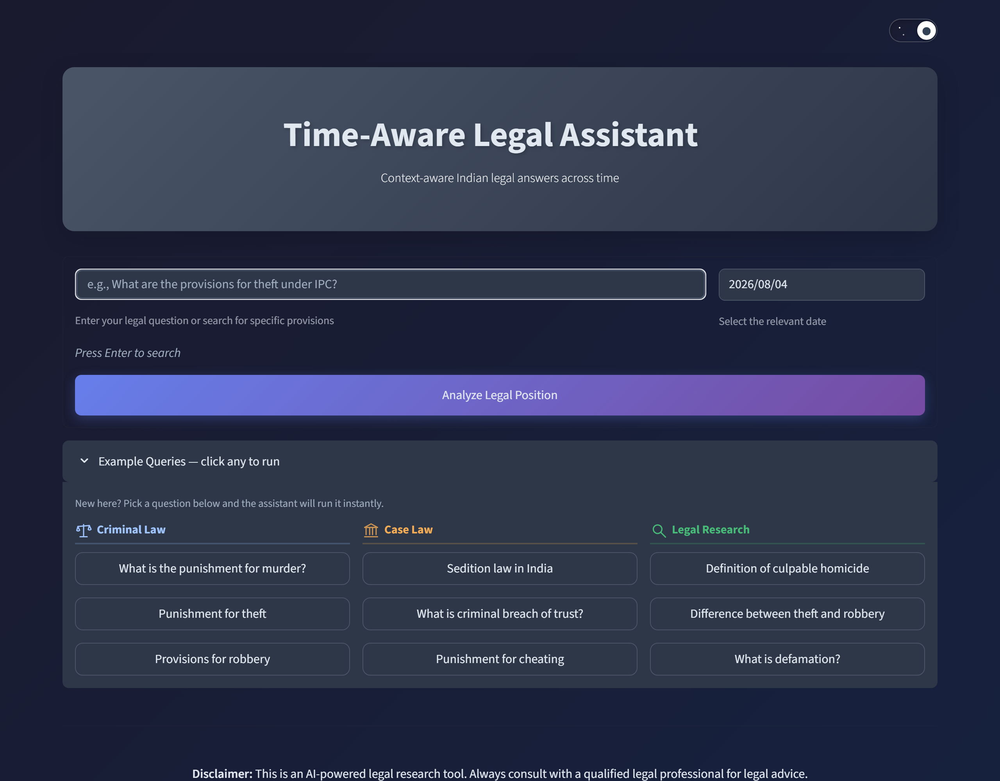
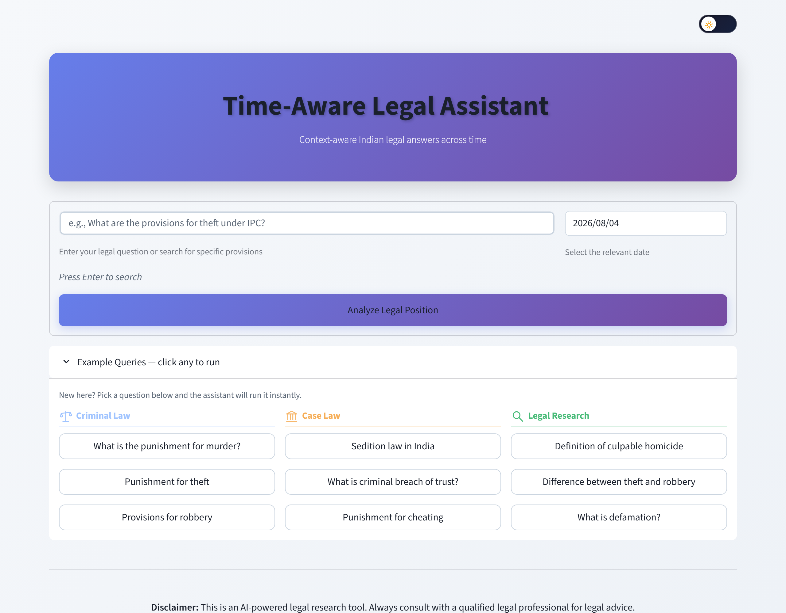
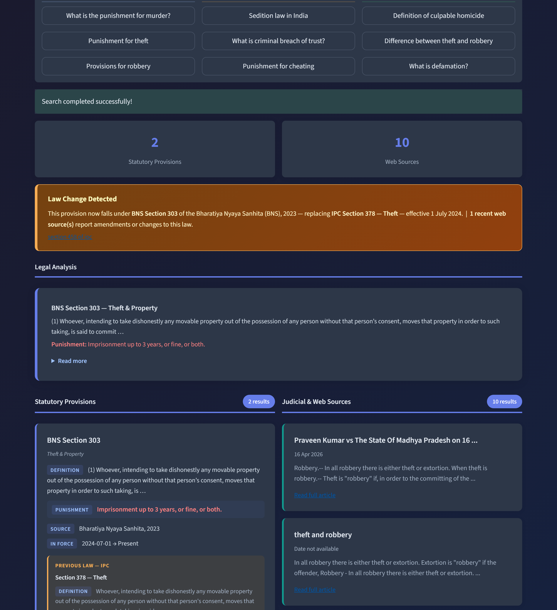

# Time-Aware Legal Assistant (IPC → BNS)

**🔗 Live demo: [temporallaw-ai.streamlit.app](https://temporallaw-ai.streamlit.app)**

A Streamlit chatbot for Indian criminal-law research that is **time-aware**: it knows the
Indian Penal Code (IPC, 1860) was replaced by the Bharatiya Nyaya Sanhita
(BNS, 2023, effective **1 July 2024**) and returns the law that was in force on a
user-selected date. It also surfaces the IPC ↔ BNS counterpart for each provision
and can pull recent judicial/web sources via SerpAPI.

The home screen ships with a client-side day/night theme toggle:

<p align="center">
  
  
</p>

<p align="center"><em>Home screen — dark and light themes</em></p>

A query returns the law in force on the selected date, a "Law Change Detected" banner
mapping the old IPC section to its new BNS counterpart, a grounded analysis, and the
statutory provisions side by side:



> **Disclaimer:** This is a research/educational tool, not legal advice.

---

## Features

- **Hybrid semantic + TF-IDF retrieval** over a curated IPC + BNS dataset — the **ChromaDB**
  vector store (embedded with Ollama `nomic-embed-text`) provides genuine meaning-based search,
  blended with TF-IDF, so unseen phrasings (e.g. "poisoned my food to kill me" → murder) work
  without a hand-written rule for every query. Falls back to a local
  `sentence-transformers` (all-MiniLM-L6-v2) index, then to pure TF-IDF, if Ollama/Chroma is down.
- **Temporal filtering & boosting** — the law active on the selected date is ranked first; not-yet-in-force law is penalised.
- **IPC ↔ BNS counterpart mapping** — old and new provisions shown side by side, with a "Law Change Detected" banner.
- **Answers with graceful fallback** — `generate_answer_safe()` returns a deterministic,
  data-built IPC↔BNS comparison for statute queries and uses the local Ollama LLM
  (`qwen2.5:0.5b-instruct`) for open-ended ones, automatically falling back to the deterministic
  answer if Ollama is down or its output can't be verified. A hallucination filter guards the LLM
  output (accepting counterpart sections and sub-parts like `103(2)`).
- **Optional web search** (SerpAPI) restricted to trusted legal sites (indiankanoon.org, livelaw.in, indiacode.nic.in).
- **Backend metrics logging** to `metrics_log.json`.
- A separate **evaluation framework** (see [EVALUATION_README.md](EVALUATION_README.md)).

---

## Requirements

- Python 3.11
- Dependencies in [requirements.txt](requirements.txt):

```bash
pip install -r requirements.txt
```

- (Optional) [Ollama](https://ollama.com) running locally for LLM-written answers on open-ended
  queries. Pull the model once: `ollama pull qwen2.5:0.5b-instruct`. If Ollama isn't running the
  app still works — it falls back to the deterministic answer automatically.
- (Optional) A SerpAPI key for web search, exposed as an environment variable:

```bash
export SERPAPI_KEY=your_key_here      # PowerShell: $env:SERPAPI_KEY="your_key_here"
```

- (Optional) A **Groq** API key to power the natural-language **Legal Analysis** on the
  deployed app (Ollama can't run on Streamlit Cloud). Get a free key at
  [console.groq.com](https://console.groq.com), then expose it:

```bash
export GROQ_API_KEY=your_key_here     # PowerShell: $env:GROQ_API_KEY="your_key_here"
```

  On Streamlit Cloud, add it under **App → Settings → Secrets** as `GROQ_API_KEY = "your_key"`.
  Without it, the Legal Analysis falls back to the deterministic grounded answer.

---

## Running the app

```bash
python -m streamlit run app.py
```

Then open http://localhost:8501. Enter a legal query, pick a **relevant date**, and click
**Analyze Legal Position**. The date drives temporal selection — e.g. a murder query dated
before 1 July 2024 should resolve to IPC, and on/after that date to BNS.

---

## Data

| File | Contents |
|------|----------|
| `IPC_updated.json` | 20 IPC sections |
| `BNS_updated.json` | 23 BNS sections |

Each entry: `law, section, title, category, content, punishment, valid_from, valid_until, source`.
`valid_from` / `valid_until` (`9999-12-31` = still in force) power the temporal logic.

`legal_db/` is the persisted ChromaDB store (53 sections embedded with `nomic-embed-text`,
768-dim). It is the **primary semantic source** at query time: the query is embedded with
`nomic-embed-text` and matched against the store, then blended with TF-IDF. Rebuild it with
`python populate_database.py` (requires `ollama pull nomic-embed-text`).

---

## How retrieval works (`app.py`)

1. `_build_full_index()` merges both JSON files and builds a TF-IDF inverted index, a
   section-number pattern, and an IPC↔BNS `counterpart_index` (via same-number matches plus a
   hardcoded `KNOWN_REPLACEMENTS` table, e.g. 302→103 murder, 124A→152 sedition).
2. `_semantic_scores()` embeds the query with `nomic-embed-text` and ranks the ChromaDB store
   (min-max normalised); `_bm25_scores()` computes BM25 keyword relevance; `_hybrid_score_all()`
   blends them as `R = 0.7·semantic + 0.3·BM25` (`SEMANTIC_WEIGHT = 0.7`, report Eq. 5.5).
   Semantic falls back to the cached MiniLM index, then to TF-IDF, if Chroma/Ollama is unavailable.
3. `chroma_search()`:
   - Direct section lookup if the query names an existing section — law- and date-aware, so
     "IPC Section 304" and "BNS Section 304" resolve correctly (returns empty for non-existent
     sections to avoid hallucination).
   - Otherwise scores all sections with the hybrid ranker, then applies the **binary temporal
     filter** `T(d)=1 if valid_from ≤ t_q ≤ valid_until else 0` (report Eq. 5.7) — statutes not in
     force on the selected date are discarded, and `S = R × T` (Eq. 5.8) — followed by
     `rerank_results()`, a date-aware `rule_based_override()`, and a confidence filter.
3. `grounded_answer()` formats the top result; `filter_hallucination()` rejects unverifiable
   sections.

Semantic similarity is now the primary ranking signal; the hand-tuned tables
(`_SECTION_SYNONYMS`, `_IPC_SYNONYMS`, `RULE_MAP`, `KEYWORD_SECTION_MAP`) act only as a thin,
date-aware post-filter for known IPC↔BNS mappings.

> **First run** downloads the MiniLM model (~80 MB) and caches it; subsequent runs are offline.
> If the model can't load, retrieval degrades gracefully to pure TF-IDF.

---

## Evaluation

See [EVALUATION_README.md](EVALUATION_README.md). The evaluation harness is `evaluation.py`,
which measures answer accuracy, temporal accuracy, law-selection accuracy, citation validity, and
hallucination rate. It reads `test_questions.json` by default (schema:
`question, expected_law, expected_section, expected_punishment, valid_date`).

```bash
python evaluation.py
```

---

## Notes

- The LLM answer path is **active** via `generate_answer_safe()`, which wraps `generate_answer`
  with an automatic fallback to `grounded_answer()` when Ollama is unavailable.
- `app1.py` and `mainappwithwebsearch.py` are earlier/simpler variants of the app kept for
  reference.
